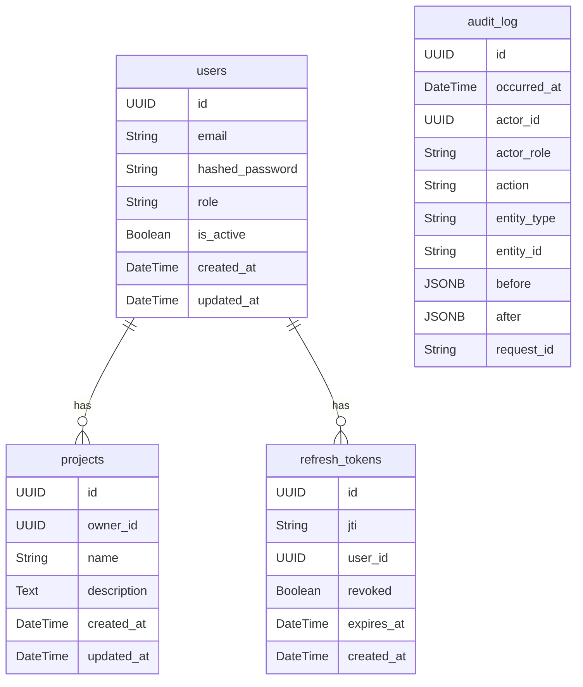

# Database ER diagram

```mermaid
erDiagram
  users ||--o{ projects : has
  users ||--o{ refresh_tokens : has
  audit_log {
    UUID id
    DateTime occurred_at
    UUID actor_id
    String actor_role
    String action
    String entity_type
    String entity_id
    JSONB before
    JSONB after
    String request_id
  }
  users {
    UUID id
    String email
    String hashed_password
    String role
    Boolean is_active
    DateTime created_at
    DateTime updated_at
  }
  projects {
    UUID id
    UUID owner_id
    String name
    Text description
    DateTime created_at
    DateTime updated_at
  }
  refresh_tokens {
    UUID id
    String jti
    UUID user_id
    Boolean revoked
    DateTime expires_at
    DateTime created_at
  }
```
